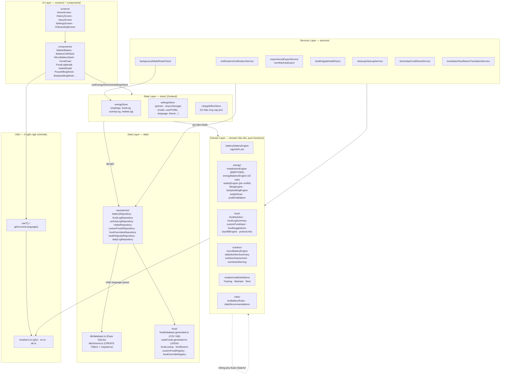
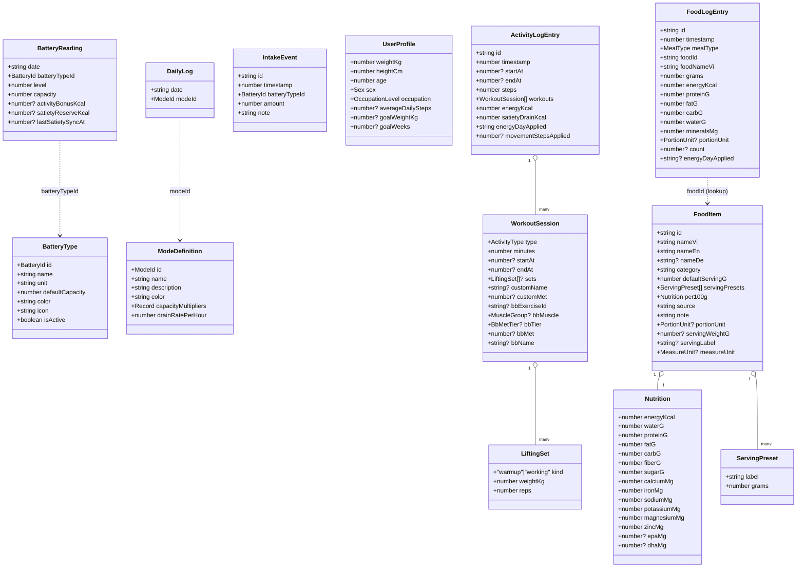
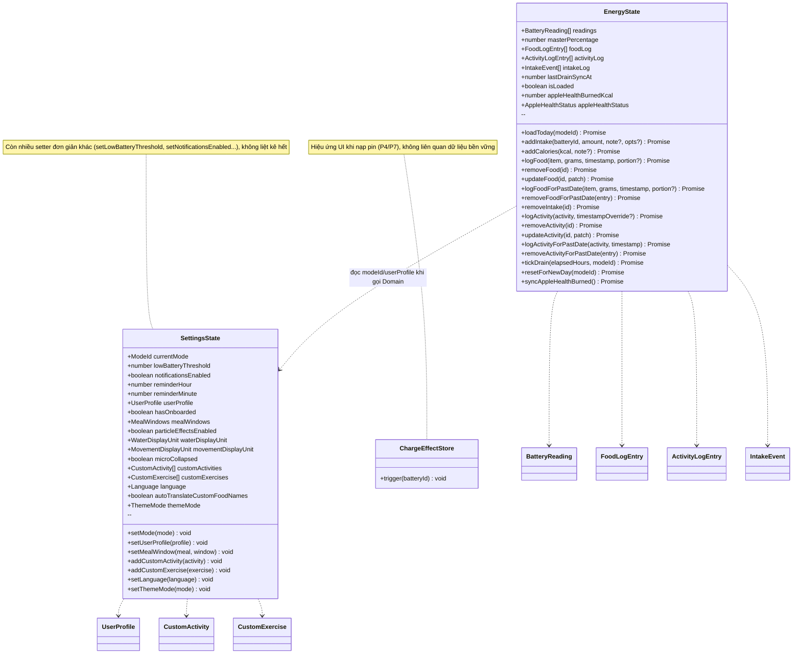
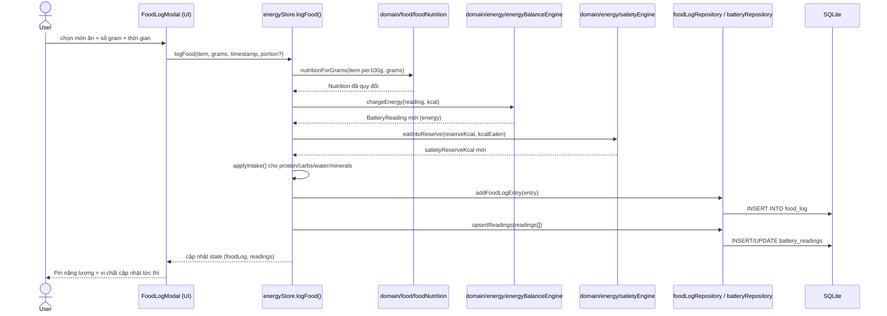
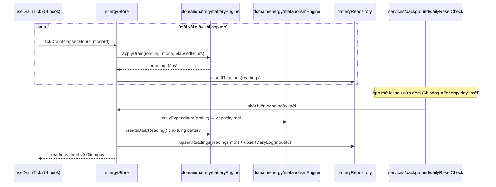
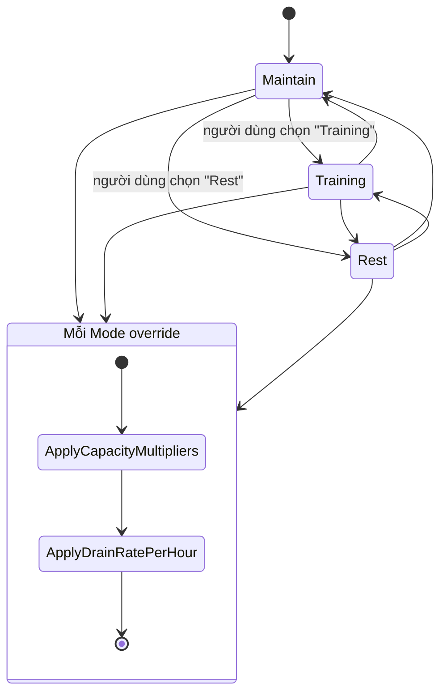
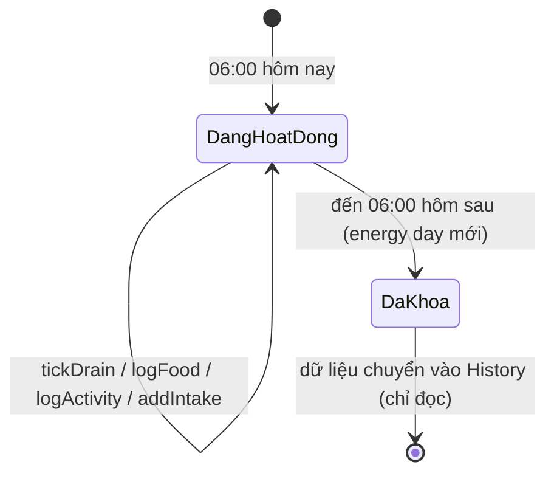
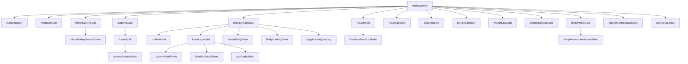

# 08 — UML tổng quan dự án (từ đầu đến Session 23)

Tài liệu này vẽ lại kiến trúc **BodyBatteries** bằng UML (Mermaid), dựa trên
mã nguồn thực tế tại thời điểm viết (2026-09-02, nhánh `ui-upgrade`, sau
commit `3787546`). Xem thêm giải thích bằng lời tại `docs/03-architecture.md`.

> Cách xem: mở file này trong VS Code có extension Mermaid, trong GitHub
> (render sẵn), hoặc dán từng khối ```mermaid``` vào https://mermaid.live.

---

## 1. Kiến trúc phân lớp (Component / Package Diagram)

Quy tắc vàng: **lớp trên chỉ gọi xuống lớp dưới, không bao giờ ngược lại.**
UI không tự lưu dữ liệu — luôn đi qua Domain → Data.



---

## 2. Class Diagram — Domain Types (`src/types/`)

Đây là các kiểu dữ liệu lõi mà toàn bộ Domain/State/UI thao tác trên đó.



---

## 3. Class Diagram — State Layer (Zustand stores)



*Lưu ý:* `SettingsState` được `persist` vào AsyncStorage (`settings-storage`);
`EnergyState` KHÔNG persist trực tiếp — nó là bản sao trong RAM của
`battery_readings`/`food_log`/`activity_log`/`intake_events` trong SQLite,
đồng bộ qua các hàm repository mỗi lần thay đổi.

---

## 4. Class Diagram — Data Layer (Repository + SQLite)

```mermaid
classDiagram
    class batteryRepository {
        +getReadingsForDate(date) Promise
        +upsertReading(reading) Promise
        +upsertReadings(readings) Promise
        +getReadingsInRange(from,to) Promise
        +getLatestEnergyReadingBefore(date) Promise
        +deleteReadingsBefore(date) Promise
    }
    class foodLogRepository {
        +addFoodLogEntry(entry) Promise
        +getFoodLogForDate(date) Promise
        +getFoodLogInRange(from,to) Promise
        +deleteFoodLogEntry(id) Promise
        +deleteFoodLogBefore(date) Promise
    }
    class activityLogRepository {
        +addActivityLogEntry(entry) Promise
        +getActivityLogForDate(date) Promise
        +getActivityLogInRange(from,to) Promise
        +updateActivityLogEntry(entry) Promise
        +deleteActivityLogEntry(id) Promise
    }
    class intakeRepository {
        +addIntakeEvent(event) Promise
        +getIntakeEventsForDate(date) Promise
        +getIntakeEventsInRange(from,to) Promise
        +deleteIntakeEventsBefore(date) Promise
        +deleteIntakeEventsByIds(ids) Promise
    }
    class dailyLogRepository {
        +getDailyLog(date) Promise
        +upsertDailyLog(log) Promise
        +getLogsInRange(from,to) Promise
        +deleteLogsBefore(date) Promise
        +saveDiaryEntry(date, content) Promise
    }
    class customFoodsRepository {
        +addCustomFood(item) Promise
        +getAllCustomFoods() Promise
        +getCustomFoodById(id) Promise
        +deleteCustomFood(id) Promise
    }
    class foodOverridesRepository {
        +upsertOverride(item) Promise
        +getAllOverrides() Promise
        +getOverrideById(id) Promise
        +deleteOverride(id) Promise
    }
    class healthSignalsRepository {
        +logWeight(kg) Promise
        +getWeightHistory(...) Promise
        +updateWeight(id, kg) Promise
        +logAppleHealthBurned(...) Promise
        +getAppleHealthBurnedForDate(date) Promise
        +recordSyncTimestamp(status) Promise
        +getLastSyncTimestamp() Promise
    }

    class SQLiteDatabase {
        <<Expo SQLite>>
        battery_types
        daily_log
        battery_readings
        intake_events
        health_signals
        diary_entries
        food_log
        custom_foods
        food_overrides
        activity_log
    }

    class foodLookup {
        +getAnyFoodById(id) FoodItem
    }
    class customFoodRegistry {
        +search(query) FoodItem[]
    }
    class foodOverrideRegistry {
        +get(foodId) FoodItem
    }

    note for foodLookup "Merge: generated catalog + custom_foods + food_overrides"
    note for customFoodRegistry "Index runtime cho custom_foods (search không cần reload app)"
    note for foodOverrideRegistry "Index runtime cho food_overrides"

    batteryRepository --> SQLiteDatabase : battery_readings
    foodLogRepository --> SQLiteDatabase : food_log
    activityLogRepository --> SQLiteDatabase : activity_log
    intakeRepository --> SQLiteDatabase : intake_events
    dailyLogRepository --> SQLiteDatabase : daily_log, diary_entries
    customFoodsRepository --> SQLiteDatabase : custom_foods
    foodOverridesRepository --> SQLiteDatabase : food_overrides
    healthSignalsRepository --> SQLiteDatabase : health_signals

    foodLookup --> customFoodRegistry
    foodLookup --> foodOverrideRegistry
    customFoodRegistry --> customFoodsRepository
    foodOverrideRegistry --> foodOverridesRepository
```



---

## 5. Sequence Diagram — Ghi nhận một bữa ăn ("logFood")

Luồng chính khi người dùng log một món ăn từ `FoodLogModal`.



---

## 6. Sequence Diagram — Xả pin theo thời gian & Reset ngày mới



---

## 7. State Diagram — Mode & vòng đời "energy day"





---

## 8. Component Diagram — Cây UI chính (Home screen)



---

## 9. Ghi chú lịch sử (mốc kiến trúc quan trọng)

| Mốc | Thay đổi kiến trúc chính |
|---|---|
| Phase 1 (MVP) | `batteryEngine` thuần (nạp/xả/%), `battery_readings` + `daily_log` SQLite |
| Phase 2 (Modes) | `modeDefinitions` + `lowBatteryRules`, `dailyResetCheck` nền |
| Phase 3 (Excel/Diary/Cleanup) | `excelExportService`, `diary_entries` (mã hoá), `cleanupService` (xoá >1 tuần) |
| S-M (Hướng B) | Đổi "energy battery" từ tổng calo cố định sang mô hình cân bằng calo (`energyBalanceEngine`), `activityBonusKcal` |
| S-Q (Satiety) | Thêm pin "no/đói" liên tục (`satietyEngine`, `satietyReserveKcal`, `lastSatietySyncAt`) |
| S-N/U7 (Food data) | Pipeline sinh `usdaFoods.generated.ts`, `searchAllFoods` gộp song ngữ, `getAnyFoodById` là điểm tra cứu bắt buộc |
| S-PL (Powerlifting) | `liftingEngine` (tấn số × ROM từ chiều cao), `LiftingSet`, set-based squat/bench/deadlift |
| S-BB (Bodybuilding) | `bodybuildingEngine` (MET-tier theo nhóm cơ), 45 bài/8 nhóm cơ, tách biệt khỏi S-PL |
| B2 | `ActivityLogEntry` độc lập (sửa/xoá được), thay cho ghi `intake_events` một chiều |
| FIX #1/#5 | `energyDayApplied` trên `FoodLogEntry`/`ActivityLogEntry` — tách "ngày lịch" khỏi "ngày năng lượng" (reset 6h sáng) |
| Session 14 (i18n) | `src/i18n/` tự viết tay (không dùng i18next), 3 ngôn ngữ vi/en/de |
| Session 20-23 | Fix hiển thị tổng pin phụ, tên món ăn theo ngôn ngữ + auto-translate, nút "Dùng làm mẫu" powerlifting |

---

*File này là ảnh chụp kiến trúc tại một thời điểm — khi thêm bảng DB, store,
hoặc domain engine mới, hãy cập nhật lại các class/sequence diagram tương ứng
ở trên (không cần tạo file UML mới cho mỗi lần đổi).*
